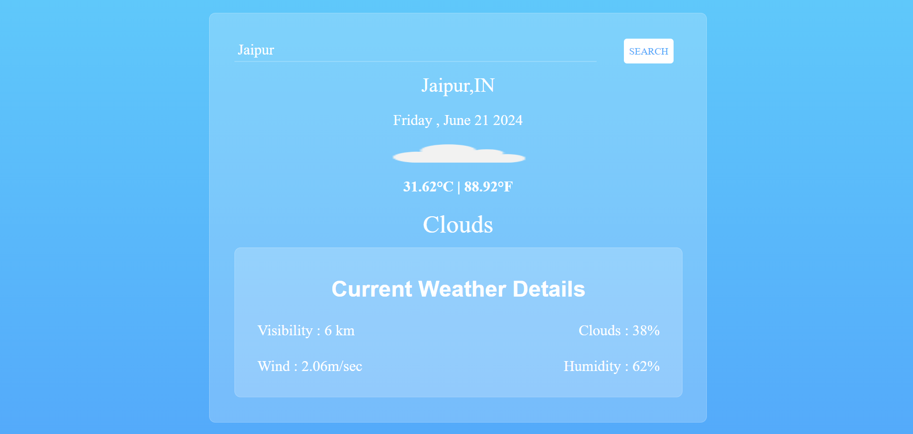

## Weather App



A responsive and dynamic weather application that fetches and displays real-time weather data using HTML, CSS, and JavaScript.

## Features

- Real-time Weather Data: Fetches weather information from a third-party API.
- Responsive Design: Ensures a seamless user experience across different devices.
- User-Friendly Interface: Simple and intuitive layout for easy navigation.

## Technologies Used

- HTML: Structure of the web application.
- CSS: Styling and layout.
- JavaScript: Dynamic content and API interactions.

## Project Setup

1. **Clone the Repository:**

   ```
   git clone https://github.com/Jyoti040/Weather-app-jyoti.git
   ```

   
2. **Navigate to the Project Directory:**

   ```
   cd Weather-app-jyoti
   ```

   
3. **Open index.html in Your Browser:**

   ```
   Simply open the index.html file in your preferred web browser to run the application.
   ```

